# Plant-Watering-System

## Pflanzen Bewässerungssystem für 5 Pflanzen

| Arduino, Relaiskarte und Überlaufsensor YL69 |
|-|
|  |

| Feuchtigkeitssensoren | | | |
|-|-|-|-|
| 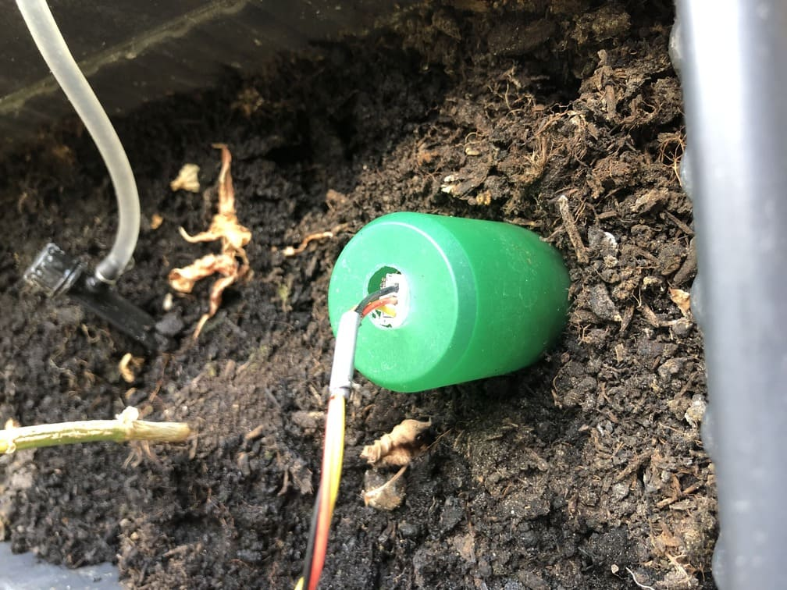 |  | 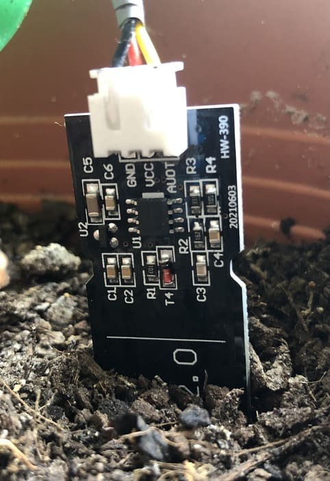 | 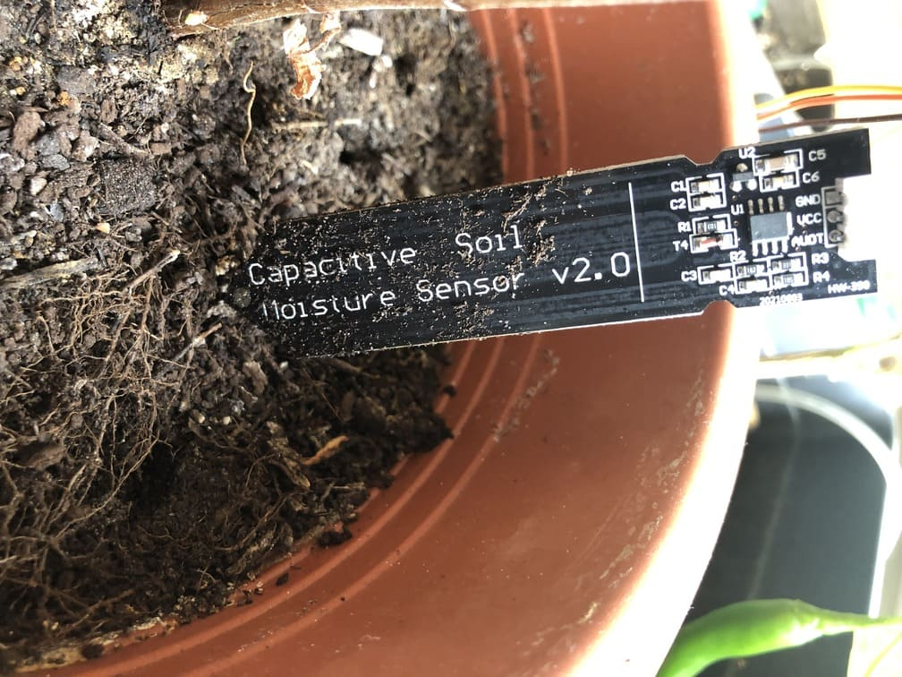 |

| Pumpe und Schwimmerschalter | Wassertank |
|-|-|
| 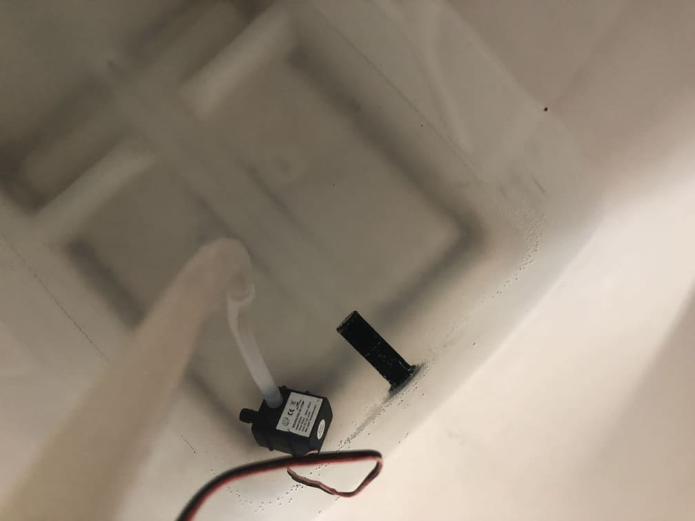 | 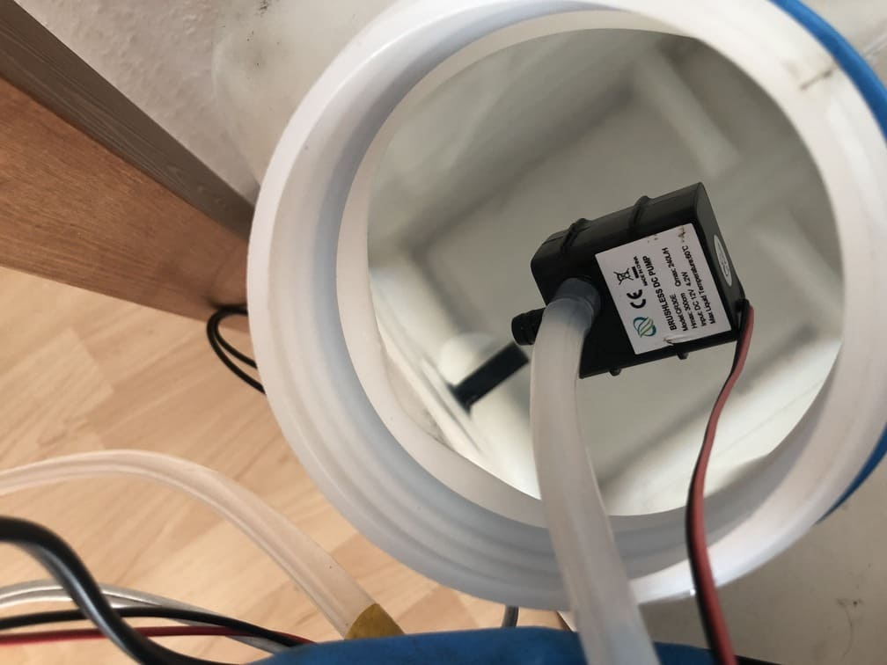 |

| Wasserschläuche mit T-Stücken | Magnetventil | Magnetventil |
|-|-|-|
|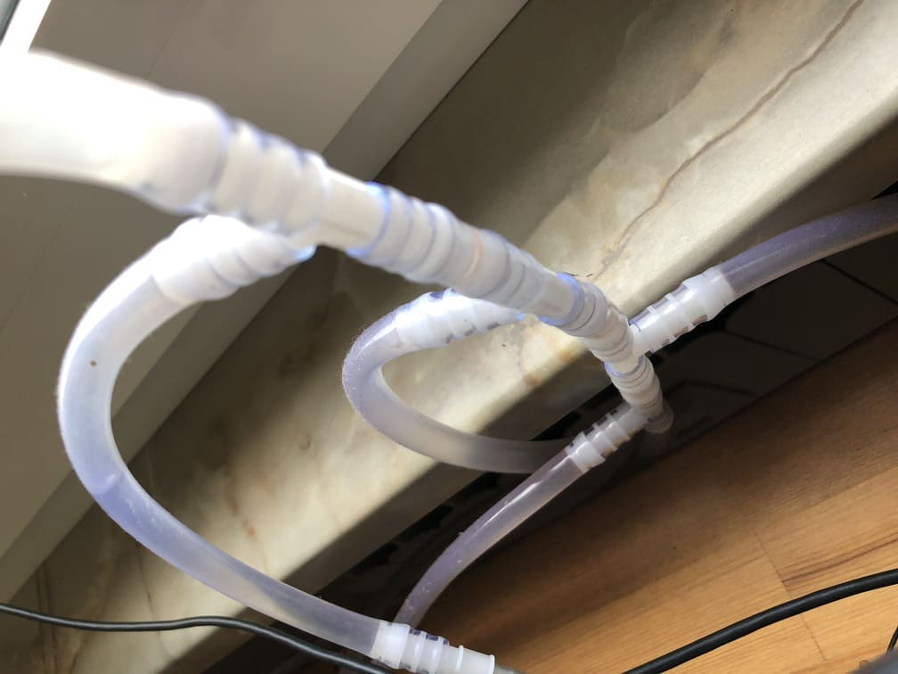 | 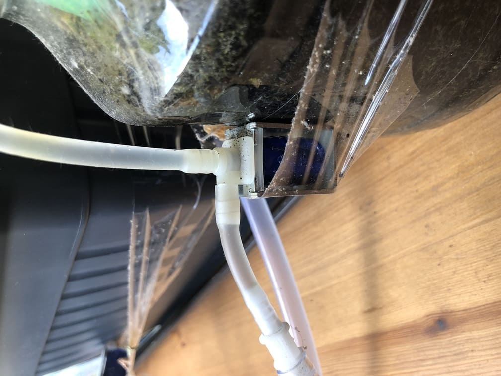 | 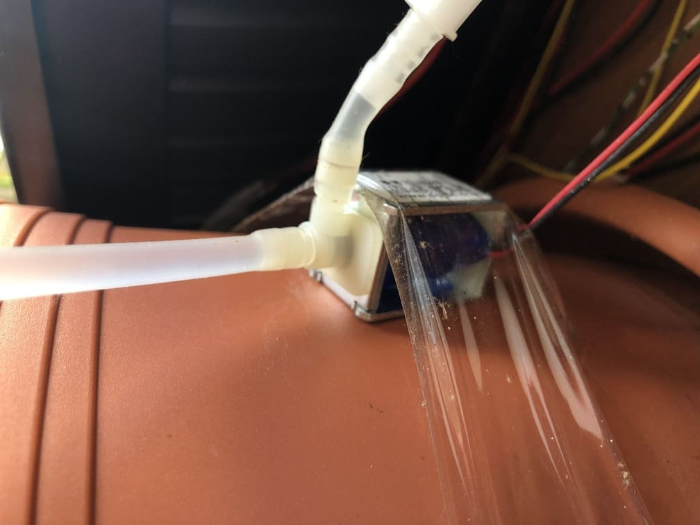 |

| Powerbank | Solarmodul | 12V Netzteil |
|-|-|-|
| 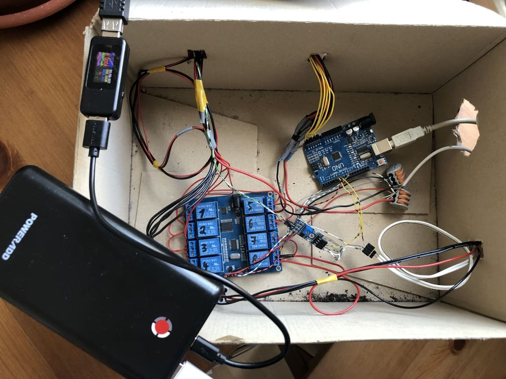 | 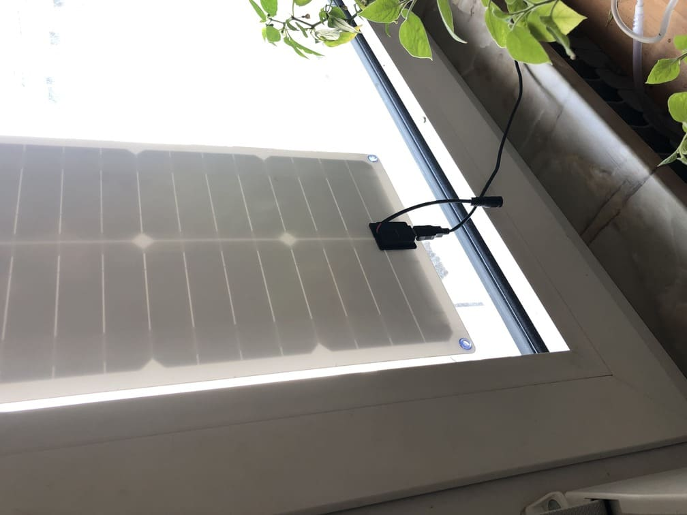 | 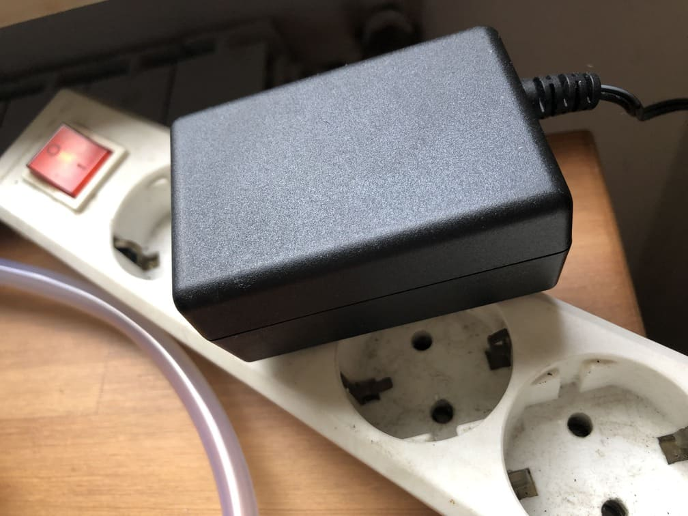 |

| Tropfer | |
|-|-|
| 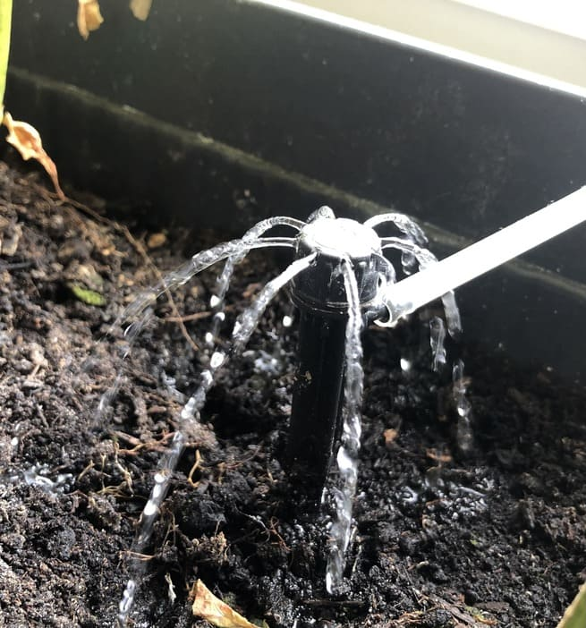 | 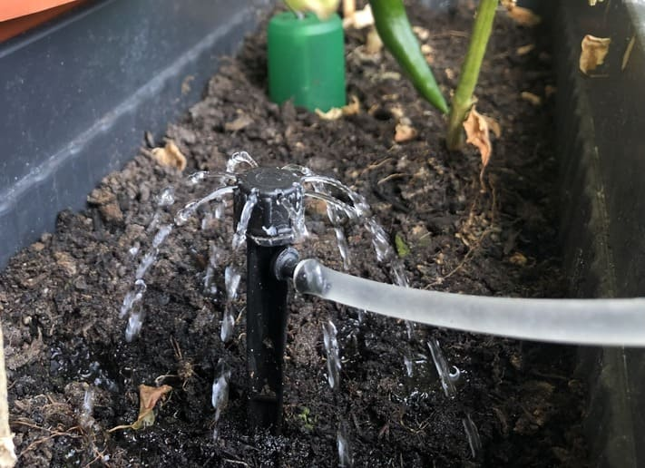 |

 

[Arduino UNO](https://www.ebay.de/itm/144138039161) 
oder 
[Arduino Nano (nicht getestet)](https://www.ebay.de/itm/255283163551)

Pin A1 bis A5 Feuchtigkeitssensoren für die Erde 
[Analog Capacitive Soil Moisture Sensor](https://www.ebay.de/itm/164657628668)

Pin 6 Überlaufsensor 
[YL-69 Feuchtigkeitssensor (nicht perfekt da kabel korrodieren aber bis jetzt keine Alternative)](https://www.ebay.de/itm/203252815145)

Pin 7 Tanküberprüfung 
[Schwimmerschalter, Pegelschalter, Füllstandsschalter, Niveauschalter](https://www.ebay.de/itm/384891203932)

Relaiskarte (diese würde ich nicht empfehlen da die Karte fehlerhaft ist, benötigt aber nur 2 Signalleitungen und Strom) 
[ICStation ICSE014A 8 Channel, Micro USB, DC 5V, 700mA](http://www.icstation.com/icstation-channel-icse014a-micro-switch-relay-module-upper-computer-control-board-icse014a-p-5185.html)

[Alternative Relaiskarte (benötigt 8x output vom Arduino und Strom)](https://www.ebay.de/itm/252355367721)

[Wasserpumpe bürstenlos 12V, 350mA, 4,2W, 240L/h, Hubhöhe 3m, Anschlüsse da = 8mm, Maße lxbxh=55x37x43mm](https://www.ebay.de/itm/353246497633)

[Magnetventile 12V, <160mA, <3W, 0,6Bar, N/C (normaly closed), Anschlüsse da = 4mm](https://www.ebay.de/itm/352962597146)

[StepDown Regler 12V zu 5V, 3A max. USB](https://www.ebay.de/itm/162759316733)

[StepUp Regler 5V zu 12V (fehlerhaft da er überhitzen kann)](https://www.ebay.de/itm/201278090992)

5x Dioden z.B. 1N4004 
(Rote) LED (zeigt leeren Tank und/oder Überlauf an) 
Im Elektroladen oder im Netz

Kabel mit kleinem Querschnitt 0,75mm²?
- ca. 10m Rot (Sensoren, Magnetventile, sonstiges)
- ca. 10m Schwarz (Sensoren, Magnetventile, sonstiges)
- ca. 4m Gelb (Sensorensignal)
- ca. 4m für das Überlaufsensor Kabel

Schläuche
- ca.2m di=4mm 
- ca.6m di=8mm 
Im Baumarkt oder im Netz kaufen

Schlauchverbinder 
[4x T-Stück 8mm](https://www.ebay.de/itm/311415522853) 
[5x Reduzierungsstück Adapter von 8mm auf 4mm](https://www.ebay.de/itm/311415522853)
  
Kanister min. 15L, Standardisierte Öffnung 48mm, DIN 61  
Im Baumarkt oder im Netz kaufen
  

Tipps

Elektronik:
- Die Dioden werden unbedingt benötigt da der Arduino sonst von der Selbstinduktionsspannung der Magnetventile einen Stromschlag bekommt (trotz der Relais)
- Arduino, Sensoren und Relaiskarte benötigen 5V. Pumpe und Magnetventile benötigen 12V. Wenn man ein 12V Netzteil oder eine Autobatterie nutzt braucht man einen StepDown regler. Wenn man ein 5V USB Netzteil oder eine Powerbank nutzt braucht man einen StepUp Regler. Man kann auch eine Powerbank/Autobatterie mit einem Solarmodul statt einem Netzteil nutzen um autark zu sein. Es wäre vom Vorteil wenn die Powerbank gleichzeitig laden und entladen kann sonst wird nur gegossen wenn die Sonne nicht scheint.
- Der Arduino Uno hat sechs analoge Eingänge für die Feuchtigkeitssensoren. somit könnte man sechs Pflanzen bewässern. Der Nano müsste mehr haben.
- Die Feuchtigkeitssensoren für die Erde sind nicht ganz präzise und müssten für jede Pflanze selbst eingestellt werden. Wenn die Elektronik des Sensors nass wird meldet er dem Arduino "Trocken" und übergießt die Pflanzen. Daher ist der Überlaufsensor sinnvoll. Bei Benutzung von Tropfern sollte man die Sensoren vor Wasser schützen z.B. alte Deckel in denen man ein Loch für die Kabel bohrt

Schläuche und mehr:
- Länge der Schläuche und Kabel muss jeder für sich berechnen. Wenn die Pflanzen nebeneinander stehen reichen die Längen die ich angegeben habe für fünf Pflanzen.
- Die 4mm Schläuche sollten so kurz wie möglich sein da sonst der Druck abfällt.
- Alle Schläuche sollten etwas härter sein damit sie nicht knicken.
- Tropfer sehen cool aus aber es geht auch mit dem Schlauch in die Erde. Sollte man auf Tropfer verzichten, kann man ausschließlich 4mm Schläuche nutzen. Auch die T-Stücke müssten dann 4mm sein und es würde nur ein 8mm auf 4mm Reduzierungsstück benötigt werden nach der Pumpe. Dafür bräuchte man allerdings noch ein kurzes Stück Schlauch l=5cm di=8mm oder eine Pumpe mit 4mm Anschluss.
- Beim Kauf des Kanisters darauf achten dass die Pumpe durch die Öffnung des Kanisters passt. Viele Kanister haben eine standardisierte Öffnung mit 48mm DIN 61. Maße Pumpe LxBxH=55x37x43mm.
  

Preise Stand 08.2022 
| Preis | Artikel |
| 13 | Kanister  |
| 8 | Pume  |
| 30 | Schläuche  |
| 14 | Schlauchverbinder  |
| 30 | 5x Magnetventile  |
| 9 | StepUp Regler (StepDown 3)  |
| 10 | Arduino Uno  |
| 10 | Relaiskarte 8 Kanäle  |
| 7 | 5x Feuchtigkeitssensoren  |
| 3 | Uberlaufsensor  |
| 5 | Tanksensor  |
| 20 | Kabel  |
| | USB Kabel  |
| | USB Hub  |
| 1 | 5x Dioden + LED  |

| 160€ | Summe |

